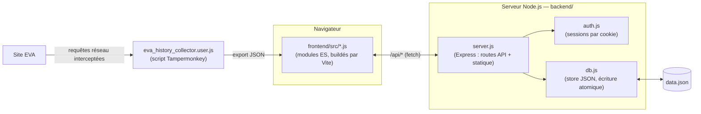

# EVA Debrief

Historique de parties, statistiques de saison et comparatifs d'équipe pour
le jeu **EVA**, auto-hébergé sur ton propre serveur. Un petit backend
Node.js stocke et déduplique les données, un frontend en une seule page
(aucun framework) les affiche sous forme de tableaux de bord détaillés.

> Projet personnel construit de façon itérative : import de données →
> analyses de plus en plus poussées → backend auto-hébergé → authentification
> → HTTPS → responsive mobile. Voir [Historique du projet](#historique-du-projet)
> pour le détail.

## Sommaire

- [Fonctionnalités](#fonctionnalités)
- [Aperçu](#aperçu)
- [Architecture](#architecture)
- [Stack technique](#stack-technique)
- [Structure du projet](#structure-du-projet)
- [Installation](#installation)
- [Où sont stockées les données](#où-sont-stockées-les-données)
- [Authentification par mot de passe](#authentification-par-mot-de-passe)
- [Garder le serveur actif en permanence](#garder-le-serveur-actif-en-permanence)
- [HTTPS](#https)
- [Sécurité — points à connaître](#️-sécurité--points-à-connaître)
- [API](#api)
- [Collecteur de données](#collecteur-de-données)
- [Historique du projet](#historique-du-projet)
- [Licence](#licence)

## Fonctionnalités

**Historique** — liste de toutes les parties importées, filtrable par
joueur/période/carte/mode, avec une vue détail par match : bandeau de score,
blocs d'équipe colorés, tableau K/D/A/Score/Dégâts/Précision/K-D/KDA avec la
meilleure valeur de chaque équipe mise en évidence.

**Tendances** — agrégats par séance de jeu ou par mois (parties, V/D,
winrate, K/D, dégâts et score moyens).

**Profil** — le plus complet des onglets :
- Carte de saison (niveau, XP, stats cumulées) à partir des captures de
  profil, avec un tableau d'évolution entre deux captures successives
  couvrant *toutes* les stats de saison (parties, K/D/A, dégâts, distance
  parcourue, temps de jeu, niveau, XP, records personnels...)
- Séries de victoires/défaites, temps de jeu, taux de MVP
- Stats d'efficacité normalisées (KDA, dégâts par mort, kills/dégâts par
  minute, précision moyenne)
- Graphiques de progression (K/D, dégâts, score, précision) et de winrate
  glissant, tous avec axes gradués et légende
- Contribution au score et aux dégâts d'équipe, partie par partie
- Performance par carte (avec **focus dédié par carte** en cliquant une
  ligne : courbe de progression et meilleures/pires parties rien que sur
  cette carte) et par mode
- Performance par jour de la semaine, moment de la journée, et effet de
  fatigue en séance (1ère partie de la soirée vs. les suivantes)
- Répartition du ratio K/D, meilleures/pires performances
- **Duo & Némésis** — coéquipiers avec qui tu gagnes le plus, adversaires
  contre qui tu gagnes le moins
- **Panneau de comparaison** — compare n'importe quel profil au tien,
  côte à côte, avec barres colorées proportionnelles

**Comparatif** — classement de tous les joueurs croisés (coéquipiers et
adversaires) dans les parties importées, triable par winrate/K-D/dégâts/score.

**Équipes** — crée des groupes de joueurs personnalisés, consulte leurs
stats agrégées, compare deux équipes entre elles.

**Transverse** — filtre de saison (les saisons sont détectées automatiquement à
partir des captures de profil importées, chacune portant le numéro de saison en
cours au moment de la capture) en plus des filtres de période (préréglages ou
dates personnalisées) et d'exclusion de cartes/modes, appliqués de façon
cohérente à tous les onglets ; le tableau d'évolution du Profil détecte aussi
tout seul un changement de saison entre deux captures (les stats de saison
repartent de 0 à chaque nouvelle saison) et signale la transition plutôt que de
calculer un delta absurde ; déduplication fiable des imports (parties par id,
profils par empreinte de contenu) ; authentification par mot de passe ; HTTPS ;
interface responsive.

## Aperçu

*(ajoute ici une capture d'écran de l'onglet Profil et une du détail d'un
match — `docs/screenshot-profil.png`, `docs/screenshot-match.png` — pour que
le rendu apparaisse directement dans ce README sur GitHub)*

```md


```

## Architecture



Le frontend ne fait aucun calcul de persistance : à chaque import, il poste
le JSON brut à `/api/import`, puis recharge l'état complet depuis
`/api/state`. Toute la déduplication et le filtrage (parties PvE exclues)
sont gérés une seule fois, côté serveur — que l'import vienne d'un
navigateur, d'un autre, ou d'un appel API direct.

Le frontend (`frontend/`) et le backend (`backend/`) sont deux projets
distincts avec chacun leur `package.json`, reliés uniquement par le contrat
HTTP `/api/*` — mais ils se déploient comme un seul process Node en
production : `npm run build` compile le frontend en fichiers statiques
(`frontend/dist`), que `backend/server.js` sert lui-même (voir
[Installation](#installation)).

## Stack technique

- **Backend** : Node.js + [Express](https://expressjs.com/), aucune autre
  dépendance de production. Pas de base de données externe.
- **Stockage** : fichier JSON unique avec écriture atomique (voir
  [pourquoi](#où-sont-stockées-les-données) plutôt qu'une base SQL).
- **Frontend** : HTML/CSS/JS vanilla (aucun framework UI), organisé en
  modules ES par domaine et buildé par [Vite](https://vitejs.dev/) (dev
  server avec rechargement à chaud + bundling pour la prod — aucune
  dépendance runtime ajoutée, Vite n'est qu'un outil de build). Graphiques
  SVG faits main (aucune librairie de charting).
- **Auth** : sessions par cookie signé, sans dépendance (`crypto` natif de
  Node), mot de passe unique partagé.
- **Collecteur** : userscript Tampermonkey qui intercepte `fetch`/`XHR` sur
  le site EVA pour capturer l'historique de parties et les profils publics.

## Structure du projet

```
eva-debrief/
├── package.json                     # Orchestrateur racine (workspaces npm, scripts dev/build/start)
├── data.json                        # Données (généré au runtime, gitignored)
├── backend/
│   ├── package.json                 # dependencies: express
│   ├── server.js                    # Point d'entrée : routes API + fichiers statiques buildés + HTTP(S)
│   ├── db.js                        # Couche de stockage (data.json, dédup, requêtes)
│   └── auth.js                      # Sessions par cookie, comparaison de mot de passe
├── frontend/
│   ├── package.json                 # devDependencies: vite
│   ├── vite.config.js                # Config Vite (multipage, proxy /api en dev)
│   ├── index.html                    # Squelette HTML de la SPA
│   ├── login.html                    # Page de connexion
│   ├── styles.css, styles/*.css       # CSS, un fichier par domaine
│   ├── src/
│   │   ├── main.js                    # Point d'entrée JS (bootstrap)
│   │   ├── state.js                   # État partagé
│   │   ├── format.js, api.js, ui-prefs.js, game-filters.js
│   │   ├── historique.js, tendances.js, comparatif.js, equipes.js
│   │   ├── profil/                    # compute.js, charts.js, analytics-view.js, season.js, index.js
│   │   └── shell.js, tabs.js, filters-ui.js, import.js, player-index.js
│   └── dist/                          # Build de prod (généré par `npm run build`, gitignored)
└── eva_history_collector.user.js    # Script Tampermonkey (côté navigateur, sur le site EVA)
```

## Installation

Prérequis : [Node.js](https://nodejs.org/) version 18 ou plus récente (déjà
présent sur la plupart des hébergements Node). Aucun compilateur, aucune
base de données externe à installer.

**En production** (un seul process Node, un seul port) :

```bash
cd eva-debrief
npm install          # installe les deux workspaces (backend + frontend)
npm run build         # build le frontend (Vite) dans frontend/dist
npm start              # démarre backend/server.js, qui sert frontend/dist + l'API
```

Le serveur démarre sur `http://localhost:3000` par défaut. Ouvre cette
adresse dans un navigateur : tu arrives directement sur l'écran d'import
(ou sur tes données si le serveur en contient déjà).

Pour changer de port :

```bash
PORT=8080 npm start
```

**En développement** (rechargement à chaud du frontend) :

```bash
npm run dev
```

Ça lance deux process en parallèle : le backend sur `:3000` (API seulement)
et le serveur de dev Vite sur `:5173` (frontend, avec proxy automatique des
appels `/api/*` vers le port 3000). **Ouvre `http://localhost:5173`**, pas
3000 — le port 3000 ne sert que l'API tant que `frontend/dist` n'a pas été
buildé au moins une fois.

## Où sont stockées les données

Dans `data.json`, à la racine du projet (`backend/db.js` y vit désormais,
mais son `DATA_DIR` par défaut remonte volontairement d'un niveau pour que
`data.json` reste au même endroit qu'avant ce déplacement). Pour changer son
emplacement :

```bash
DATA_DIR=/var/lib/eva-debrief npm start
# ou
DATA_FILE=mes-donnees.json npm start
```

**Sauvegarde :** ce fichier unique contient tout (parties, profils,
équipes). Le copier suffit à faire une sauvegarde complète. Tu peux aussi
récupérer un export complet à tout moment via `GET /api/export`.

**Pourquoi un fichier JSON plutôt qu'une "vraie" base SQL ?** `backend/db.js`
stocke tout avec une écriture atomique (jamais de fichier à moitié écrit
même si le process est tué en pleine sauvegarde). Ce choix est volontaire :
les bases SQL embarquées type `better-sqlite3` demandent une compilation
native (C++) qui échoue souvent sur des hébergements standards sans outils
de build — c'est d'ailleurs ce qui s'est produit en développant cette appli.
Un fichier JSON, lui, fonctionne partout où Node tourne, sans rien à
compiler. Pour le volume de données concerné ici (l'historique de parties
d'un joueur ou d'un petit groupe), c'est largement suffisant. Si tu préfères
une vraie base SQL plus tard (Postgres, MySQL, SQLite natif...), seul
`backend/db.js` a besoin d'être réécrit — `backend/server.js` et le
frontend n'ont pas à changer, tant que les mêmes fonctions sont exportées.

## Authentification par mot de passe

Le site est protégé par un mot de passe unique (pas de comptes séparés — un
mot de passe partagé, comme pour un accès privé personnel ou familial).

```bash
EVA_PASSWORD=un-mot-de-passe-solide npm start
```

Sans cette variable, le serveur démarre quand même mais affiche un
avertissement au démarrage et **reste accessible sans mot de passe** —
pratique en développement local, à éviter en production.

Comment ça marche : toute requête (page ou API) sans session valide est
redirigée vers `/login.html` (ou reçoit une réponse `401` pour les appels API).
Une fois le bon mot de passe saisi, une session est créée (cookie
`HttpOnly`, 30 jours, marqué `Secure` automatiquement si servi en HTTPS) et
stockée en mémoire côté serveur — un redémarrage du serveur déconnecte tout
le monde, ce qui est acceptable pour cet usage. Le bouton "Déconnexion" en
haut à droite de l'appli met fin à la session à tout moment.

Pour le définir de façon permanente avec systemd, ajoute dans le fichier
`.service` (section `[Service]`) :

```ini
Environment=EVA_PASSWORD=un-mot-de-passe-solide
```

Avec pm2 :

```bash
EVA_PASSWORD=un-mot-de-passe-solide pm2 start backend/server.js --name eva-debrief
pm2 save
```

⚠️ Ce mot de passe circule en clair entre le navigateur et le serveur au
moment de la connexion — **utilise toujours HTTPS en production** (voir la
section [HTTPS](#https) plus bas) pour qu'il ne soit pas intercepté sur le
réseau.

## Garder le serveur actif en permanence

### Avec systemd (recommandé sur un VPS Linux)

⚠️ Le service ne rebuild pas le frontend tout seul : lance `npm run build`
après chaque mise à jour du code (`git pull && npm install && npm run build`)
avant de redémarrer le service.

Crée `/etc/systemd/system/eva-debrief.service` :

```ini
[Unit]
Description=EVA Debrief server
After=network.target

[Service]
Type=simple
WorkingDirectory=/chemin/vers/eva-debrief
ExecStart=/usr/bin/node backend/server.js
Restart=on-failure
Environment=PORT=3000

[Install]
WantedBy=multi-user.target
```

Puis :

```bash
sudo systemctl enable --now eva-debrief
```

### Avec pm2 (alternative simple)

```bash
npm install -g pm2
npm run build   # build le frontend avant de démarrer (voir remarque ci-dessus)
pm2 start backend/server.js --name eva-debrief
pm2 save
pm2 startup   # affiche la commande à lancer pour le démarrage automatique
```

## HTTPS

Le mot de passe et le cookie de session ne devraient jamais circuler en
clair sur le réseau — active HTTPS d'une des façons suivantes.

### Option A — reverse proxy (recommandé pour un vrai nom de domaine)

C'est l'option la plus simple à maintenir : le reverse proxy gère
l'obtention et le **renouvellement automatique** du certificat, le serveur
Node continue de tourner en HTTP tout simple derrière lui.

**Avec Caddy** (zéro configuration, HTTPS automatique dès qu'un nom de
domaine pointe vers le serveur) — un seul fichier `Caddyfile` :

```
eva.tondomaine.fr {
    reverse_proxy localhost:3000
}
```

```bash
caddy run
```

**Avec nginx + certbot :**

```nginx
server {
    listen 80;
    server_name eva.tondomaine.fr;

    location / {
        proxy_pass http://localhost:3000;
        proxy_set_header Host $host;
        proxy_set_header X-Real-IP $remote_addr;
        proxy_set_header X-Forwarded-Proto $scheme;
    }
}
```

```bash
sudo certbot --nginx -d eva.tondomaine.fr
```

`certbot` réécrit automatiquement la config nginx pour ajouter le `listen
443 ssl`, le certificat, et une redirection HTTP → HTTPS. Le renouvellement
se fait ensuite tout seul (tâche planifiée installée par certbot).

#### Avec un nom DDNS (IP dynamique) plutôt qu'un domaine classique

Ça fonctionne exactement pareil — remplace juste `eva.tondomaine.fr` par
ton nom DDNS (ex: `tonpseudo.ddns.net`) dans les configs ci-dessus. Trois
choses à vérifier en plus :

1. **Redirige les ports 80 et 443 (TCP)** sur ton routeur vers l'IP locale
   de la machine qui héberge le reverse proxy — indispensable pour que
   Let's Encrypt puisse valider ton nom de domaine depuis l'extérieur.
2. **Vérifie que tu n'es pas derrière du CGNAT** (IP partagée entre
   plusieurs foyers par ton FAI) : compare l'IP WAN affichée par ton
   routeur avec ton IP publique réelle (ex: whatismyip.com, depuis un
   autre réseau). Si elles diffèrent, la redirection de ports est
   impossible sans IP publique dédiée (souvent une option payante chez le
   FAI) ou sans passer par un tunnel (Cloudflare Tunnel, ngrok...) à la
   place de la redirection de ports classique.
3. **Rien à reconfigurer quand ton IP change** : le client DDNS met à jour
   le DNS tout seul, le reverse proxy ne fait que résoudre le nom d'hôte à
   chaque requête — aucune IP fixe codée en dur nulle part dans ces
   configs.

### Option B — HTTPS directement dans ce serveur (sans reverse proxy)

Utile si tu n'as pas de reverse proxy en amont. Fournis un certificat au
serveur Node lui-même :

```bash
SSL_KEY_PATH=/chemin/vers/privkey.pem \
SSL_CERT_PATH=/chemin/vers/cert.pem \
EVA_PASSWORD=un-mot-de-passe-solide \
npm start
```

Le serveur bascule alors entièrement en HTTPS (`https://...`). Le cookie de
session reçoit automatiquement le flag `Secure` dès qu'il détecte une vraie
connexion chiffrée.

Pour aussi rediriger le port HTTP habituel vers HTTPS (ex: 80 → 443) :

```bash
PORT=443 HTTP_REDIRECT_PORT=80 SSL_KEY_PATH=... SSL_CERT_PATH=... npm start
```

⚠️ Les ports < 1024 (80, 443) demandent des droits root sur Linux — soit tu
lances avec `sudo`, soit tu autorises Node à les utiliser sans root :
```bash
sudo setcap 'cap_net_bind_service=+ep' $(which node)
```
Sinon, choisis des ports plus hauts (ex: `PORT=3443`) et redirige-les depuis
un pare-feu ou une box, ou repasse par l'option A.

**Obtenir un certificat gratuit sans reverse proxy** (mode standalone de
certbot — arrête temporairement le serveur le temps de l'obtention) :

```bash
sudo certbot certonly --standalone -d eva.tondomaine.fr
# certificats généralement dans /etc/letsencrypt/live/eva.tondomaine.fr/
```

Attention : contrairement à l'option A, il n'y a ici aucun renouvellement
automatique tant que le serveur tourne — `certbot renew` doit être rejoué
(et le serveur relancé) périodiquement, par exemple via une tâche planifiée
(cron) qui redémarre le service après renouvellement.

### Option C — certificat auto-signé (test en local uniquement)

Pour tester HTTPS sans nom de domaine ni certificat public (le navigateur
affichera un avertissement de sécurité, normal pour un certificat
auto-signé) :

```bash
openssl req -x509 -newkey rsa:2048 -keyout key.pem -out cert.pem -days 365 -nodes -subj "/CN=localhost"
SSL_KEY_PATH=./key.pem SSL_CERT_PATH=./cert.pem npm start
```

## ⚠️ Sécurité — points à connaître

Même avec `EVA_PASSWORD` défini, garde en tête que :

- Le mot de passe est unique et partagé — pas de comptes séparés, pas de
  droits différenciés. Toute personne qui le connaît a un accès complet
  (import, réinitialisation de toute la base comprise).
- Les sessions vivent en mémoire côté serveur : elles disparaissent à
  chaque redémarrage, et rien n'est fait pour limiter les tentatives de
  connexion répétées (pas de rate-limiting). Pour un usage exposé sur
  internet, ajoute quand même une couche supplémentaire si possible :
  - Garde-le sur ton réseau local ou derrière un VPN (Tailscale,
    WireGuard...) si tu n'as pas besoin d'y accéder depuis l'extérieur.
  - Utilise toujours HTTPS via un reverse proxy (voir plus haut) — sans ça,
    le mot de passe et le cookie de session circulent en clair.
  - Peut se combiner avec une protection supplémentaire côté reverse proxy
    (nginx `auth_basic`, restriction par IP) si tu veux une double barrière.

## API

| Méthode | Route            | Auth requise | Description |
|---------|------------------|:---:|--------------|
| POST    | `/api/login`     | non | `{ password }` → crée une session (cookie) |
| POST    | `/api/logout`    | non | Termine la session en cours |
| GET     | `/api/state`     | oui | Renvoie tout : parties, profils, équipes |
| GET     | `/api/health`    | oui | Statut + compteurs |
| POST    | `/api/import`    | oui | Importe un JSON (mêmes formats que l'ancien import du navigateur) |
| GET     | `/api/export`    | oui | Export brut complet (sauvegarde) |
| GET     | `/api/teams`     | oui | Liste des équipes |
| POST    | `/api/teams`     | oui | Crée une équipe `{ name, members: [userId,...] }` |
| PUT     | `/api/teams/:id` | oui | Modifie une équipe |
| DELETE  | `/api/teams/:id` | oui | Supprime une équipe |
| DELETE  | `/api/reset`     | oui | Vide toute la base (irréversible) |

("Auth requise" ne s'applique que si `EVA_PASSWORD` est défini — sinon tout
est ouvert, voir la section [Authentification](#authentification-par-mot-de-passe).)

## Collecteur de données

`eva_history_collector.user.js` est un script [Tampermonkey](https://www.tampermonkey.net/)
à installer dans le navigateur, sur le site EVA lui-même — pas sur ce
serveur. Il intercepte les requêtes réseau de la page (historique de
parties, stats de profil) et affiche un petit panneau flottant pour
télécharger un export JSON, à importer ensuite dans la visionneuse via
"+ Importer".

Les stats de saison sont capturées via ta page de profil **connectée**
(`getPlayerByUserId`) — les pages de profil **publiques** d'un autre joueur
(`getPublicPlayerByUsername`) ne fonctionnent actuellement plus côté EVA.gg.
Le script reconnaît toujours ce format au cas où EVA le réactive un jour,
mais pour l'instant, importe ta propre page de profil connectée (comme
n'importe quelle autre page du site) pour suivre tes stats de saison ;
récupérer les stats de saison *d'un autre joueur* n'est plus possible tant
que les pages publiques restent cassées (ses stats par partie, elles,
continuent d'apparaître normalement dans l'historique de parties).

## Historique du projet

Ce projet a démarré comme un simple fichier HTML statique lisant des
exports JSON collés à la main, puis a évolué par itérations : ajout
progressif d'analyses (tendances, profils, comparatifs), extraction en
équipes personnalisées, migration vers un vrai backend avec déduplication
centralisée, authentification, HTTPS, puis une passe de responsive design
et de polish visuel, puis d'un découpage du frontend monofichier en modules
ES (buildés par Vite) avec séparation nette entre `backend/` et `frontend/`.
Le code reflète cette histoire — les commentaires dans `backend/server.js`/
`backend/db.js`/`backend/auth.js` et dans `frontend/src/*.js` expliquent le
*pourquoi* de chaque choix (fichier JSON plutôt que SQL, sessions maison
plutôt qu'une lib, état partagé en un seul objet plutôt que des `let`
séparés, etc.), pas seulement le *quoi*.

## Licence

[MIT](LICENSE)
