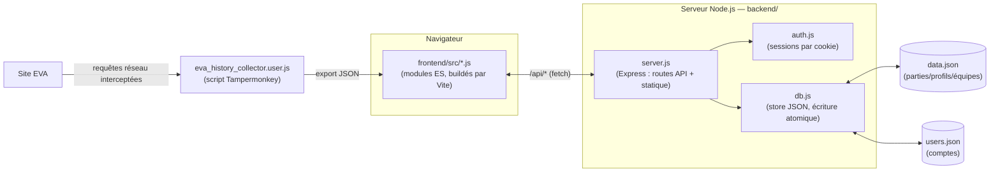

# EVA Debrief

Historique de parties, statistiques de saison et comparatifs d'équipe pour
le jeu **EVA**, auto-hébergé sur ton propre serveur. Un petit backend
Node.js stocke et déduplique les données, un frontend en une seule page
(aucun framework) les affiche sous forme de tableaux de bord détaillés.

> Projet personnel construit de façon itérative : import de données →
> analyses de plus en plus poussées → backend auto-hébergé → authentification
> → HTTPS → responsive mobile. Voir [Historique du projet](#historique-du-projet)
> pour le détail.

## Sommaire

- [Fonctionnalités](#fonctionnalités)
- [Aperçu](#aperçu)
- [Architecture](#architecture)
- [Stack technique](#stack-technique)
- [Structure du projet](#structure-du-projet)
- [Installation](#installation)
- [Déployer le frontend sur GitHub Pages](#déployer-le-frontend-sur-github-pages)
- [Où sont stockées les données](#où-sont-stockées-les-données)
- [Comptes et rôles](#comptes-et-rôles)
- [Garder le serveur actif en permanence](#garder-le-serveur-actif-en-permanence)
- [HTTPS](#https)
- [Sécurité — points à connaître](#️-sécurité--points-à-connaître)
- [API](#api)
- [Collecteur de données](#collecteur-de-données)
- [Historique du projet](#historique-du-projet)
- [Licence](#licence)

## Fonctionnalités

**Historique** — liste de toutes les parties importées, filtrable par
joueur/période/carte/mode, avec un **MVP** (icône ★) mis en avant sur le
meilleur joueur de chaque partie (dans la liste comme dans le détail), et une
vue détail par match : bandeau de score, blocs d'équipe colorés, tableau
K/D/A/Score/Dégâts/Précision/K-D/KDA/**Rating** (indice façon HLTV, voir
[Rang compétitif](#fonctionnalités) ci-dessous) avec la meilleure valeur de
chaque équipe mise en évidence — **chaque colonne est triable** en cliquant
son en-tête (inversion du sens au deuxième clic).

**Tendances** — agrégats par séance de jeu ou par mois (parties, V/D,
winrate, K/D, dégâts et score moyens), avec 4 graphiques d'évolution
correspondants (taux de victoire, ratio K/D, dégâts moyens, score moyen).

**Profil** — le plus complet des onglets :
- Carte de saison (niveau, XP, stats cumulées) à partir des captures de
  profil, avec un tableau d'évolution entre deux captures successives
  couvrant les stats de saison disponibles (parties, K/D/A, meilleure série,
  MVP, distance parcourue, niveau, XP...) — dégâts totaux et temps de jeu
  cumulés affichés "n/d" sur toute capture récente, EVA ayant retiré ces
  deux champs de son API (voir [Collecteur de données](#collecteur-de-données))
- **Rang compétitif** — badge de palier (Bronze à Légende, 3 divisions
  chacun) et courbe d'évolution du LP (voir [Rang compétitif](#fonctionnalités)
  ci-dessous)
- Séries de victoires/défaites, temps de jeu, taux de MVP
- **Rating façon HLTV** — un seul chiffre combinant kills/morts/dégâts/
  assists/score, centré sur 1.00 = performance moyenne parmi les joueurs
  croisés sur la période
- **Score d'impact** — pondère taux de victoire et contribution aux dégâts
  d'équipe (par rapport à la juste part vu la taille de l'équipe)
- Stats d'efficacité normalisées (KDA, dégâts par mort, kills/dégâts par
  minute, précision moyenne)
- Graphiques de progression (K/D, dégâts, score, précision) et de winrate
  glissant, tous avec axes gradués et légende
- Contribution au score et aux dégâts d'équipe, partie par partie
- Performance par carte (avec **focus dédié par carte** en cliquant une
  ligne : courbe de progression et meilleures/pires parties rien que sur
  cette carte) et par mode
- Performance par jour de la semaine, moment de la journée, et effet de
  fatigue en séance (1ère partie de la soirée vs. les suivantes)
- Répartition du ratio K/D, meilleures/pires performances
- **Duo & Némésis** — coéquipiers avec qui tu gagnes le plus, adversaires
  contre qui tu gagnes le moins
- **Panneau de comparaison** — compare n'importe quel profil au tien,
  côte à côte, avec barres colorées proportionnelles

**Comparatif** — classement de tous les joueurs croisés (coéquipiers et
adversaires) dans les parties importées, triable par winrate/K-D/dégâts/
score/score d'impact/**rang**, avec un seuil ajustable de parties croisées
minimum (1 à 10) pour ignorer les rencontres trop rares.

**Équipes** — crée des groupes de joueurs personnalisés, consulte leurs
stats agrégées, compare deux équipes entre elles.

**Rang compétitif** — un système de rang façon jeu compétitif (Bronze,
Argent, Or, Platine, Émeraude, Diamant, Prodige, Légende, chacun en 3
divisions), entièrement calculé côté client à partir de l'historique de
parties (EVA n'expose aucune notion de LP — voir `frontend/src/rank.js`).
Visible dans l'en-tête (rang du joueur sélectionné), dans Comparatif (colonne
triable), dans Profil (badge, LP, progression dans la division courante,
courbe d'évolution) et dans Historique (gain/perte de LP affiché partie par
partie, à côté du MVP, pour le joueur sélectionné).

Calcul précis, rejoué partie par partie dans l'ordre chronologique (jamais
dans l'ordre d'import) :

1. Les deux équipes de la partie sont comparées sur leur **LP moyen
   courant** (`BASE_LP = 1000` par défaut pour un joueur jamais vu). Espérance
   Elo standard : `attendu(A) = 1 / (1 + 10^((moyenneLP(B) − moyenneLP(A)) / 400))`.
2. Le résultat réel de CHAQUE joueur vient de sa propre issue de partie
   (jamais re-déduit du score d'équipe) : Victoire = 1, Défaite = 0, tout
   autre résultat (match nul) = 0.5 — pour ne pas punir les deux équipes
   comme si elles avaient perdu un résultat que personne n'a réellement
   perdu.
3. `deltaRésultat = K_OUTCOME × (résultat réel − résultat attendu)`, avec
   `K_OUTCOME = 28` — une victoire attendue rapporte peu, une victoire
   surprise beaucoup (et symétriquement pour une défaite).
4. Un bonus/malus de **performance individuelle** s'ajoute, tiré du Rating
   façon HLTV de cette partie précise (voir plus haut — combinaison pondérée
   de kills/morts/dégâts/assists/score, 1.00 = moyenne du lobby de cette
   partie) : `bonusPerf = K_PERFORMANCE × clamp(rating − 1, −1, 1)`, avec
   `K_PERFORMANCE = 10`. **Additif**, jamais multiplicatif : un
   multiplicatif inverserait le signe (une bonne perf individuelle dans une
   défaite ferait perdre *plus* de LP au lieu de moins) et écraserait le
   bonus dès que le delta de résultat est proche de zéro (match équilibré).
5. `delta = deltaRésultat + bonusPerf` ; nouveau LP =
   `max(LP_FLOOR, LP précédent + delta)`, avec `LP_FLOOR = 100`
   (plancher, pour qu'une série noire ne fasse pas partir le LP en négatif).

Swing maximum en une seule partie ≈ 38 points (grosse surprise + performance
exceptionnelle) ; partie équilibrée typique ≈ ±14 à ±24 points. Les paliers
font 300 points chacun (3 divisions de 100), donc changer de palier demande
plusieurs parties de sur/sous-performance soutenue, pas un simple coup de
chance. Une partie sans détail complet (score/dégâts/équipe absents, voir
plus bas) ou dont les deux équipes ne peuvent pas être clairement séparées
n'est pas prise en compte.

Le LP suit dynamiquement le filtre de saison plutôt qu'une période libre :
une saison précise sélectionnée repart d'une base neutre et ne rejoue que les
parties de cette saison (reset façon ranked saisonnier) ; sans saison
sélectionnée, le LP est continu sur toute la carrière, indépendamment d'une
période libre éventuellement active en parallèle.

**Transverse** — filtre de saison (les saisons sont détectées automatiquement à
partir des captures de profil et, depuis la v9.0 du collecteur, des parties
elles-mêmes — chacune porte désormais aussi son propre numéro de saison, donc
la liste de saisons reste disponible même pour un import qui ne contient que
de l'historique de parties, sans capture de profil ; quand une saison précise
est sélectionnée, les parties qui portent ce numéro sont filtrées exactement
plutôt que par une fenêtre de dates approximative) en plus des filtres de
période (préréglages ou dates personnalisées) et d'exclusion de cartes/modes,
appliqués de façon cohérente à tous les onglets ; le tableau d'évolution du
Profil détecte aussi tout seul un changement de saison entre deux captures
(les stats de saison repartent de 0 à chaque nouvelle saison) et signale la
transition plutôt que de calculer un delta absurde ; déduplication fiable des
imports (parties par id, profils par empreinte de contenu) ; comptes avec
rôles (admin / lecture seule) ; HTTPS ; interface responsive.

## Aperçu

*(ajoute ici une capture d'écran de l'onglet Profil et une du détail d'un
match — `docs/screenshot-profil.png`, `docs/screenshot-match.png` — pour que
le rendu apparaisse directement dans ce README sur GitHub)*

```md


```

## Architecture



Le frontend ne fait aucun calcul de persistance : à chaque import, il poste
le JSON brut à `/api/import`, puis recharge l'état complet depuis
`/api/state`. Toute la déduplication et le filtrage (parties PvE exclues)
sont gérés une seule fois, côté serveur — que l'import vienne d'un
navigateur, d'un autre, ou d'un appel API direct.

Le frontend (`frontend/`) et le backend (`backend/`) sont deux projets
distincts avec chacun leur `package.json`, reliés uniquement par le contrat
HTTP `/api/*` — mais ils se déploient comme un seul process Node en
production : `npm run build` compile le frontend en fichiers statiques
(`frontend/dist`), que `backend/server.js` sert lui-même (voir
[Installation](#installation)).

## Stack technique

- **Backend** : Node.js + [Express](https://expressjs.com/), aucune autre
  dépendance de production. Pas de base de données externe.
- **Stockage** : fichier JSON unique avec écriture atomique (voir
  [pourquoi](#où-sont-stockées-les-données) plutôt qu'une base SQL).
- **Frontend** : HTML/CSS/JS vanilla (aucun framework UI), organisé en
  modules ES par domaine et buildé par [Vite](https://vitejs.dev/) (dev
  server avec rechargement à chaud + bundling pour la prod — aucune
  dépendance runtime ajoutée, Vite n'est qu'un outil de build). Graphiques
  SVG faits main (aucune librairie de charting).
- **Auth** : sessions par cookie signé, sans dépendance (`crypto` natif de
  Node), mot de passe unique partagé.
- **Collecteur** : userscript Tampermonkey qui intercepte `fetch`/`XHR` sur
  le site EVA pour capturer l'historique de parties et ta page de profil
  connectée (les pages de profil publiques n'existent plus côté EVA).

## Structure du projet

```
eva-debrief/
├── package.json                     # Orchestrateur racine (workspaces npm, scripts dev/build/start)
├── data.json                        # Parties/profils/équipes (généré au runtime, gitignored)
├── users.json                       # Comptes (généré au runtime, gitignored, séparé de data.json)
├── sessions.json                    # Sessions ouvertes (généré au runtime, gitignored, séparé de users.json)
├── .env.example                     # Modèle de fichier .env (voir Installation)
├── .github/workflows/
│   ├── ci.yml                        # npm test sur chaque push (hors main)/pull request
│   └── deploy-gh-pages.yml          # npm test, puis build + publie frontend/dist sur GitHub Pages (voir plus bas)
├── backend/
│   ├── package.json                 # dependencies: express
│   ├── server.js                    # Point d'entrée : routes API + fichiers statiques buildés + HTTP(S)
│   ├── db.js                        # Couche de stockage (data.json + users.json, dédup, requêtes)
│   ├── auth.js                      # Sessions par cookie, hachage de mot de passe, rôles
│   └── env.js                       # Chargeur .env minimal (pas de dépendance dotenv)
├── frontend/
│   ├── package.json                 # devDependencies: vite
│   ├── vite.config.js                # Config Vite (multipage, proxy /api en dev)
│   ├── index.html                    # Squelette HTML de la SPA
│   ├── login.html                    # Page de connexion / inscription / création du 1er admin
│   ├── styles.css, styles/*.css       # CSS, un fichier par domaine
│   ├── src/
│   │   ├── main.js                    # Point d'entrée JS (bootstrap)
│   │   ├── login.js                   # Logique de login.html (module externe, voir CSP)
│   │   ├── state.js                   # État partagé
│   │   ├── format.js, api.js, api-base.js, ui-prefs.js, game-filters.js, rank.js
│   │   ├── seasons.js                 # Détection des saisons, résolution seasonId, normalisation des captures de profil
│   │   ├── historique.js, tendances.js, comparatif.js, equipes.js, comptes.js
│   │   ├── player-links.js, player-names.js, team-detect.js
│   │   ├── backups.js, settings.js    # Enveloppes API pour les panneaux admin de l'onglet Comptes
│   │   ├── profil/                    # compute.js, charts.js, analytics-view.js, season.js, index.js
│   │   └── shell.js, tabs.js, filters-ui.js, import.js, player-index.js
│   └── dist/                          # Build de prod (généré par `npm run build`, gitignored)
├── eva_history_collector.user.js    # Script Tampermonkey (côté navigateur, sur le site EVA)
└── eva_network_inspector.user.js    # Script Tampermonkey de diagnostic (journalise tout le GraphQL du site, voir Collecteur de données)
```

## Installation

Prérequis : [Node.js](https://nodejs.org/) version 18 ou plus récente (déjà
présent sur la plupart des hébergements Node). Aucun compilateur, aucune
base de données externe à installer.

**En production** (un seul process Node, un seul port) :

```bash
cd eva-debrief
npm install          # installe les deux workspaces (backend + frontend)
npm run build         # build le frontend (Vite) dans frontend/dist
npm start              # démarre backend/server.js, qui sert frontend/dist + l'API
```

Le serveur démarre sur `http://localhost:3000` par défaut. Ouvre cette
adresse dans un navigateur : tu arrives directement sur l'écran d'import
(ou sur tes données si le serveur en contient déjà).

Pour changer de port :

```bash
PORT=8080 npm start
```

### Fichier `.env` (éviter de répéter les variables à chaque lancement)

Toutes les variables d'environnement du backend (`PORT`, `EVA_ADMIN_USERNAME`/
`EVA_ADMIN_PASSWORD`, `TURNSTILE_SITE_KEY`/`TURNSTILE_SECRET_KEY`,
`SSL_KEY_PATH`/`SSL_CERT_PATH`, `DATA_DIR`/`DATA_FILE`...) peuvent aussi être
mises une bonne fois dans un fichier `.env` à la racine du repo, plutôt que
préfixées devant chaque commande :

```bash
cp .env.example .env
# puis édite .env avec tes valeurs
npm start
```

`backend/server.js` le charge automatiquement s'il existe (`backend/env.js`,
un petit parseur maison, pas de dépendance `dotenv` ajoutée). `.env` n'est
jamais commité (voir `.gitignore`) — `.env.example` sert de modèle. Une
variable déjà présente dans l'environnement réel (ex: `PORT=4000 npm start`)
reste prioritaire sur celle du `.env`.

**En développement** (rechargement à chaud du frontend) :

```bash
npm run dev
```

Ça lance deux process en parallèle : le backend sur `:3000` (API seulement)
et le serveur de dev Vite sur `:5173` (frontend, avec proxy automatique des
appels `/api/*` vers le port 3000). **Ouvre `http://localhost:5173`**, pas
3000 — le port 3000 ne sert que l'API tant que `frontend/dist` n'a pas été
buildé au moins une fois.

#### Lancer une deuxième instance de dev en parallèle

Utile pour tester une branche pendant que l'instance habituelle tourne encore.
Change le port du backend (`PORT`) et celui du serveur de dev Vite
(`VITE_PORT`) — `frontend/vite.config.js` fait automatiquement pointer son
proxy `/api/*` vers le bon port backend :

```bash
PORT=3001 VITE_PORT=5174 npm run dev
```

Ouvre alors `http://localhost:5174`. Pense aussi à isoler les données de
cette deuxième instance (sinon les deux écrivent dans le même `data.json`) :

```bash
PORT=3001 VITE_PORT=5174 DATA_FILE=data.dev.json npm run dev
```

## Déployer le frontend sur GitHub Pages

GitHub Pages n'héberge que du contenu **statique** — pas de Node.js, pas de
stockage persistant. Le backend (`backend/server.js`, `data.json`/
`users.json`) ne peut donc pas y tourner : ce qui est décrit ici publie
uniquement le **frontend buildé** sur `https://<toi>.github.io/<repo>/`, en
le faisant pointer vers un backend hébergé **ailleurs**, en HTTPS (VPS avec
domaine/DDNS, voir [HTTPS](#https) et
[Garder le serveur actif en permanence](#garder-le-serveur-actif-en-permanence)
plus haut). Le frontend et le backend vivent alors sur deux origines
différentes (cross-origin) : il faut l'autoriser explicitement des deux
côtés.

**1. Active GitHub Pages sur le repo** — Settings → Pages → Source =
*"GitHub Actions"* (pas "Deploy from a branch"). Le workflow
`.github/workflows/deploy-gh-pages.yml` fait tourner `npm test` (backend +
frontend) puis build et publie automatiquement `frontend/dist` à chaque
push sur `main` (ou à la demande, onglet Actions → "Run workflow") — la
publication n'a jamais lieu si un test échoue. `.github/workflows/ci.yml`
fait tourner les mêmes tests sur les autres branches et les pull requests,
pour un retour avant même un merge vers `main`.

**2. Renseigne l'URL du backend** — Settings → Secrets and variables →
Actions → onglet **Variables** (pas Secrets, c'est une URL publique) → crée
`API_BASE_URL` = l'URL HTTPS publique du backend, sans slash final (ex:
`https://eva.tondomaine.fr`). Le workflow l'injecte au build
(`VITE_API_BASE_URL`, lue par `frontend/src/api-base.js`) — sans elle, le
frontend continue d'appeler des chemins relatifs (`/api/...`), qui
n'existent pas sur GitHub Pages.

**3. Autorise cette origine côté backend** — sur le serveur qui héberge le
backend, définis `CORS_ORIGIN=https://<toi>.github.io` (voir
[.env](#fichier-env-éviter-de-répéter-les-variables-à-chaque-lancement)) puis
redémarre le service. Sans ça, le navigateur bloque les requêtes
cross-origin (CORS) et l'API refuse tout appel venant de GitHub Pages.

Une fois les trois réglages faits, `https://<toi>.github.io/<repo>/`
fonctionne exactement comme une instance auto-hébergée classique — import,
authentification, tous les onglets — juste avec le frontend et le backend
sur deux domaines séparés plutôt qu'un seul process qui sert les deux.

**Authentification en cross-origin : jeton plutôt que cookie.** En
déploiement même-origine (`npm start` classique), la session repose
uniquement sur un cookie `HttpOnly` (voir [Comptes et rôles](#comptes-et-rôles)).
Un tel cookie ne suffit plus une fois le frontend hébergé ailleurs que le
backend : Safari (iOS et macOS), avec son réglage "Empêcher la navigation
intersite" activé par défaut, bloque silencieusement tout cookie posé par
une requête cross-site — même avec `SameSite=None; Secure` — ce qui se
traduisait par une boucle de reconnexion sur mobile alors que la même app
fonctionnait normalement sur desktop (Chrome/Firefox laissent passer ce
cookie sans problème). Le build cross-origin (`VITE_API_BASE_URL` défini,
donc n'importe quel build via `deploy-gh-pages.yml`) contourne ça
automatiquement : à la connexion, le serveur renvoie aussi le jeton de
session dans le corps JSON (en plus du cookie), le frontend le stocke dans
`localStorage` et l'envoie ensuite via l'en-tête `Authorization: Bearer` sur
chaque appel `/api/*` (voir `frontend/src/api-base.js::CROSS_ORIGIN` et
`backend/auth.js::bearerToken()`) — aucune politique de cookie du navigateur
ne s'applique à un en-tête HTTP classique. Rien à configurer : ce mécanisme
s'active tout seul dès que `VITE_API_BASE_URL` est défini au build, et reste
totalement inactif (aucun jeton stocké, cookie seul comme avant) en
déploiement même-origine — où le cookie `HttpOnly` reste préférable
(invisible au JS de la page, donc insensible à un vol de jeton par XSS).

**Backend sans aucun frontend local (`BACKEND_ONLY=1`).** Une fois le
frontend entièrement basculé sur GitHub Pages, plus besoin que ce serveur
serve quoi que ce soit d'autre que l'API : `BACKEND_ONLY=1` (voir
`.env.example`) désactive `express.static`/`login.html` — toute route hors
`/api/*` répond alors un `404` JSON explicite plutôt que d'essayer de
servir un `frontend/dist` qui n'a même plus besoin d'exister sur cette
machine (`npm run build` devient inutile ici, `npm start` suffit après
`npm install`). Pense à définir `CORS_ORIGIN` vers l'origine GitHub Pages
dans tous les cas (voir réglage 3 ci-dessus) — sans ça, le frontend distant
ne peut de toute façon pas appeler cette API. Pour créer le tout premier
compte admin sans passer par `/login.html` (qui n'existe plus ici), utilise
le frontend distant, ou directement :
```bash
curl -X POST http://localhost:3000/api/setup \
  -H "Content-Type: application/json" \
  -d '{"username":"admin","password":"un-mot-de-passe-solide"}'
```
(ou `EVA_ADMIN_USERNAME`/`EVA_ADMIN_PASSWORD` au démarrage, voir
[Comptes et rôles](#comptes-et-rôles) — fonctionne pareil en `BACKEND_ONLY`.)

⚠️ Limite connue : les en-têtes de sécurité (CSP, `X-Frame-Options`) posés
par `backend/server.js` protègent les pages qu'IL sert lui-même — ils ne
s'appliquent pas aux pages servies par GitHub Pages. L'app fonctionne
normalement (Turnstile compris), seule cette couche de durcissement
supplémentaire n'est pas active côté GitHub Pages pour l'instant.

## Où sont stockées les données

Dans **trois fichiers séparés** à la racine du projet, pour pouvoir les
sauvegarder/versionner indépendamment :

- `data.json` — parties, profils de saison, équipes.
- `users.json` — comptes (identifiants, mots de passe hachés, rôles). Séparé
  exprès de `data.json` : ce sont des données sensibles, pas les mêmes
  enjeux de sauvegarde (tu voudras peut-être versionner `data.json` souvent
  et `users.json` plus rarement, ou les stocker sur des supports différents).
- `sessions.json` — sessions ouvertes (voir [Comptes et rôles](#comptes-et-rôles)).
  Séparé aussi de `users.json` : un jeton de session volé donne un accès
  complet SANS mot de passe, au moins aussi sensible qu'un hash. Retombe sur
  `DATA_DIR` par défaut comme `users.json` (`SESSIONS_DATA_DIR`/
  `SESSIONS_DATA_FILE` pour le déplacer indépendamment) — jamais concerné
  par les sauvegardes automatiques/`GET /api/export` ci-dessous, contrairement
  aux deux autres (une session n'a aucun intérêt à être restaurée : elle vaut
  mieux recréée par une vraie reconnexion).

Pour changer leur emplacement :

```bash
DATA_DIR=/var/lib/eva-debrief npm start
# ou individuellement :
DATA_FILE=mes-donnees.json npm start
USERS_DATA_DIR=/chemin/plus/restreint USERS_DATA_FILE=comptes.json npm start
```

`USERS_DATA_DIR` retombe sur `DATA_DIR` par défaut (même dossier, fichier
différent) si tu ne le précises pas.

**Migration automatique :** si tu avais déjà des comptes créés avant cette
séparation (ils vivaient alors dans `data.json` lui-même), ils sont détectés
et déplacés vers `users.json` tout seuls au premier démarrage après mise à
jour — rien à faire, aucune donnée perdue. Un message dans les logs du
serveur confirme la migration (`[db] Migration : comptes trouvés dans...`).

**Sauvegarde manuelle :** copier ces deux fichiers suffit à faire une
sauvegarde complète (un seul suffit si tu ne veux sauvegarder que l'un des
deux). Tu peux aussi récupérer un export complet des données de jeu à tout
moment via `GET /api/export` (les comptes n'y figurent pas, par sécurité).

**Sauvegardes automatiques :** le serveur prend lui-même des copies
horodatées de `data.json`/`users.json` — toutes les 24h par défaut
(`BACKUP_INTERVAL_HOURS`, `0` pour désactiver), avec une sauvegarde
immédiate au démarrage s'il n'en existe pas déjà une récente (pour ne pas
en reprendre une à chaque redémarrage en développement avec `--watch`).
Stockées dans `BACKUP_DIR` (`data.json`, dossier `backups/`, par défaut),
les 30 plus récentes sont conservées (`BACKUP_RETENTION`), les plus
anciennes purgées automatiquement. Consultables et déclenchables à la main
depuis l'onglet Comptes (réservé aux admins), ou via l'API : `GET /api/backups`
(liste), `POST /api/backups` (sauvegarde immédiate), `GET /api/backups/<nom-de-fichier>`
(télécharger un fichier précis). **Pas de restauration depuis l'interface** —
une tentative en usage réel a fini en verrouillage complet (comptes écrasés
d'un coup, mot de passe compris, sans savoir à l'avance si le compte de
l'admin qui déclenche l'action y survit) : remplacer `data.json`/`users.json`
par les fichiers voulus à la main, puis redémarrer le serveur, reste le
geste volontaire recommandé — plus lent, mais sans surprise possible.

**Pourquoi un fichier JSON plutôt qu'une "vraie" base SQL ?** `backend/db.js`
stocke tout avec une écriture atomique (jamais de fichier à moitié écrit
même si le process est tué en pleine sauvegarde). Ce choix est volontaire :
les bases SQL embarquées type `better-sqlite3` demandent une compilation
native (C++) qui échoue souvent sur des hébergements standards sans outils
de build — c'est d'ailleurs ce qui s'est produit en développant cette appli.
Un fichier JSON, lui, fonctionne partout où Node tourne, sans rien à
compiler. Pour le volume de données concerné ici (l'historique de parties
d'un joueur ou d'un petit groupe), c'est largement suffisant. Si tu préfères
une vraie base SQL plus tard (Postgres, MySQL, SQLite natif...), seul
`backend/db.js` a besoin d'être réécrit — `backend/server.js` et le
frontend n'ont pas à changer, tant que les mêmes fonctions sont exportées.

## Comptes et rôles

Le site est protégé par de vrais comptes individuels (username + mot de
passe), chacun avec un rôle :

- **admin** — accès complet : import, gestion des équipes, reset de la base,
  et gestion des comptes (onglet "Comptes", visible seulement pour ce rôle).
- **contributor** — peut consulter et importer des données, mais ne peut ni
  créer/modifier/supprimer une équipe, ni réinitialiser la base, ni gérer les
  comptes.
- **readonly** (lecture seule) — consultation uniquement : import, équipes,
  reset et gestion des comptes sont tous bloqués.

Ces restrictions sont appliquées côté serveur (pas seulement masquées dans
l'interface) — voir `requireImportAccess`/`requireAdmin` dans
`backend/server.js`.

Tant qu'aucun compte n'existe, le site reste accessible sans connexion (avec
un avertissement bien visible au démarrage) — dès qu'on ouvre `/login.html`,
un formulaire propose de créer le premier compte (automatiquement en rôle
admin). Il n'y a ensuite aucun moyen de repasser en mode "sans compte" : au
moins un admin doit toujours exister (le dernier admin ne peut être ni
supprimé ni rétrogradé).

Pour créer ce premier compte automatiquement au démarrage (déploiement
scripté, sans passer par l'écran de création) :

```bash
EVA_ADMIN_USERNAME=admin EVA_ADMIN_PASSWORD=un-mot-de-passe-solide npm start
```

(ou dans ton `.env`, voir [Installation](#installation) — évite de laisser un
mot de passe traîner dans l'historique du shell.)

Cette variable ne sert qu'au tout premier démarrage (si un compte existe déjà,
elle est ignorée) — les comptes suivants se créent depuis l'onglet "Comptes".

### Inscription publique (optionnelle)

En plus de la création manuelle par un admin, une page d'inscription
publique peut être activée — `/login.html` propose alors un lien "Pas de
compte ? Crée-en un" en plus du formulaire de connexion. Elle demande
username + email + mot de passe et est protégée par un captcha
[Cloudflare Turnstile](https://developers.cloudflare.com/turnstile/) pour
limiter les inscriptions automatisées par des bots. Un compte créé ainsi est
toujours en rôle `readonly` (jamais choisi par la personne qui s'inscrit) —
un admin le promeut ensuite manuellement depuis l'onglet "Comptes" si besoin.
L'email n'est pas vérifié (pas d'email de confirmation envoyé) : il est
seulement stocké sur le compte, visible par les admins dans l'onglet
"Comptes".

Désactivée par défaut — tant que les variables ci-dessous ne sont pas
définies, le lien d'inscription n'apparaît nulle part et `/api/register`
refuse tout :

```bash
TURNSTILE_SITE_KEY=xxxx TURNSTILE_SECRET_KEY=yyyy npm start
```

(ou dans ton `.env`, voir [Installation](#installation).)

Une fois ces clés configurées, un admin peut à tout moment fermer ou rouvrir
le lien d'inscription depuis l'onglet "Comptes" — sans toucher aux variables
d'environnement ni redémarrer le serveur (utile pour couper temporairement
les inscriptions une fois le groupe au complet, par exemple). Ce réglage est
persisté dans `users.json` et vient s'ajouter à `TURNSTILE_SITE_KEY`/
`TURNSTILE_SECRET_KEY`, pas s'y substituer : les deux doivent être réunis
pour que le lien apparaisse (voir `isRegistrationEnabled()` dans
`backend/server.js`).

Pour obtenir ces clés : [dash.cloudflare.com](https://dash.cloudflare.com) →
Turnstile → "Add site" → mode "Managed", en indiquant ton nom de domaine
(`tonpseudo.ddns.net` par exemple). Ajoute aussi `localhost` à la liste des
domaines autorisés du widget si tu veux tester l'inscription en développement
(`npm run dev`).

Comment ça marche techniquement : mots de passe hachés avec `crypto.scrypt`
(sel aléatoire par compte, jamais stockés en clair) ; toute requête (page ou
API) sans session valide est redirigée vers `/login.html` (ou reçoit une
réponse `401` pour les appels API) ; une fois connecté, une session est créée
(cookie `HttpOnly`, 30 jours, marqué `Secure` automatiquement si servi en
HTTPS) et persistée dans `sessions.json` (voir
[Où sont stockées les données](#où-sont-stockées-les-données)) — un
redémarrage du serveur (déploiement, crash) ne déconnecte donc plus
personne. Le bouton "Déconnexion" en haut à droite de l'appli met fin à la
session à tout moment. Changer le rôle ou le mot de passe d'un compte
invalide immédiatement ses sessions ouvertes.

⚠️ Le mot de passe circule en clair entre le navigateur et le serveur au
moment de la connexion — **utilise toujours HTTPS en production** (voir la
section [HTTPS](#https) plus bas) pour qu'il ne soit pas intercepté sur le
réseau.

### Outils admin de qualité des données

L'onglet "Comptes" (admin uniquement) va au-delà de la gestion des accès —
il regroupe aussi les outils qui corrigent la façon dont les *joueurs*
(pas les comptes de connexion à cette app) sont identifiés/affichés à
partir des données EVA importées :

- **Fusion de comptes joueurs** — regroupe plusieurs comptes EVA (smurfs)
  d'une même personne sous un seul profil dans toutes les stats de l'app
  (`POST/DELETE /api/player-links`, `frontend/src/player-links.js`). Aucune
  partie ni capture stockée n'est modifiée : la fusion n'agit qu'au niveau
  de la résolution d'identité (`canonicalUid()`), donc toujours réversible.
- **Renommer un joueur** — le pseudo affiché suit déjà automatiquement le
  plus récent vu en jeu ; ce réglage force un nom différent si besoin (ex:
  retirer un tag d'équipe de l'affichage) sans toucher aux données de
  partie (`PUT/DELETE /api/player-names/:uid`, `frontend/src/player-names.js`).
- **Analyse des joueurs** — recalcule et affiche l'état actuel du pseudo de
  chaque joueur connu à partir de l'ensemble des parties/captures déjà
  importées, pour vérifier que les deux outils ci-dessus ont bien pris effet.
- **Détection automatique d'équipes par pseudo** — repère les joueurs dont
  le pseudo EVA suit le format `TAGxJoueur` (ex: `ALPHAxJoueur1`, au
  moins 2 joueurs partageant le même tag) et propose de créer l'équipe
  personnalisée correspondante ou d'y ajouter les nouveaux membres détectés
  (`frontend/src/team-detect.js`, réutilise les routes `/api/teams`
  existantes plutôt qu'une route dédiée).

## Garder le serveur actif en permanence

### Avec systemd (recommandé sur un VPS Linux)

⚠️ Le service ne rebuild pas le frontend tout seul : lance `npm run build`
après chaque mise à jour du code (`git pull && npm install && npm run build`)
avant de redémarrer le service.

Crée `/etc/systemd/system/eva-debrief.service` :

```ini
[Unit]
Description=EVA Debrief server
After=network.target

[Service]
Type=simple
WorkingDirectory=/chemin/vers/eva-debrief
ExecStart=/usr/bin/node backend/server.js
Restart=on-failure
Environment=PORT=3000

[Install]
WantedBy=multi-user.target
```

Puis :

```bash
sudo systemctl enable --now eva-debrief
```

`Environment=PORT=3000` est facultatif si tu as déjà un `.env` à la racine du
repo (voir [Installation](#installation)) — il est chargé automatiquement,
quelle que soit la façon dont le process est démarré.

### Avec pm2 (alternative simple)

```bash
npm install -g pm2
npm run build   # build le frontend avant de démarrer (voir remarque ci-dessus)
pm2 start backend/server.js --name eva-debrief
pm2 save
pm2 startup   # affiche la commande à lancer pour le démarrage automatique
```

## HTTPS

Le mot de passe et le cookie de session ne devraient jamais circuler en
clair sur le réseau — active HTTPS d'une des façons suivantes.

### Option A — reverse proxy (recommandé pour un vrai nom de domaine)

C'est l'option la plus simple à maintenir : le reverse proxy gère
l'obtention et le **renouvellement automatique** du certificat, le serveur
Node continue de tourner en HTTP tout simple derrière lui.

**Avec Caddy** (zéro configuration, HTTPS automatique dès qu'un nom de
domaine pointe vers le serveur) — un seul fichier `Caddyfile` :

```
eva.tondomaine.fr {
    reverse_proxy localhost:3000
}
```

```bash
caddy run
```

**Avec nginx + certbot :**

```nginx
server {
    listen 80;
    server_name eva.tondomaine.fr;

    location / {
        proxy_pass http://localhost:3000;
        proxy_set_header Host $host;
        proxy_set_header X-Real-IP $remote_addr;
        proxy_set_header X-Forwarded-For $proxy_add_x_forwarded_for;
        proxy_set_header X-Forwarded-Proto $scheme;
    }
}
```

```bash
sudo certbot --nginx -d eva.tondomaine.fr
```

`certbot` réécrit automatiquement la config nginx pour ajouter le `listen
443 ssl`, le certificat, et une redirection HTTP → HTTPS. Le renouvellement
se fait ensuite tout seul (tâche planifiée installée par certbot).

**Derrière l'un ou l'autre de ces deux reverse proxy, pense à activer
`TRUST_PROXY=1`** (voir [.env](#fichier-env-éviter-de-répéter-les-variables-à-chaque-lancement))
pour que la [limitation des tentatives de connexion](#️-sécurité--points-à-connaître)
identifie chaque utilisateur par sa vraie IP plutôt que par celle du reverse
proxy — sans ça, tout le monde semble venir de la même IP (`localhost`), et
un seul utilisateur qui se trompe de mot de passe suffirait à bloquer tout
le monde. Caddy pose `X-Forwarded-For` tout seul ; la config nginx
ci-dessus l'inclut déjà.

#### Avec un nom DDNS (IP dynamique) plutôt qu'un domaine classique

Ça fonctionne exactement pareil — remplace juste `eva.tondomaine.fr` par
ton nom DDNS (ex: `tonpseudo.ddns.net`) dans les configs ci-dessus. Trois
choses à vérifier en plus :

1. **Redirige les ports 80 et 443 (TCP)** sur ton routeur vers l'IP locale
   de la machine qui héberge le reverse proxy — indispensable pour que
   Let's Encrypt puisse valider ton nom de domaine depuis l'extérieur.
2. **Vérifie que tu n'es pas derrière du CGNAT** (IP partagée entre
   plusieurs foyers par ton FAI) : compare l'IP WAN affichée par ton
   routeur avec ton IP publique réelle (ex: whatismyip.com, depuis un
   autre réseau). Si elles diffèrent, la redirection de ports est
   impossible sans IP publique dédiée (souvent une option payante chez le
   FAI) ou sans passer par un tunnel (Cloudflare Tunnel, ngrok...) à la
   place de la redirection de ports classique.
3. **Rien à reconfigurer quand ton IP change** : le client DDNS met à jour
   le DNS tout seul, le reverse proxy ne fait que résoudre le nom d'hôte à
   chaque requête — aucune IP fixe codée en dur nulle part dans ces
   configs.

### Option B — HTTPS directement dans ce serveur (sans reverse proxy)

Utile si tu n'as pas de reverse proxy en amont. Fournis un certificat au
serveur Node lui-même :

```bash
SSL_KEY_PATH=/chemin/vers/privkey.pem \
SSL_CERT_PATH=/chemin/vers/cert.pem \
npm start
```

Optionnellement `SSL_CA_PATH=/chemin/vers/chain.pem` si ton certificat a
besoin d'une chaîne d'autorité intermédiaire.

Le serveur bascule alors entièrement en HTTPS (`https://...`). Le cookie de
session reçoit automatiquement le flag `Secure` dès qu'il détecte une vraie
connexion chiffrée.

Pour aussi rediriger le port HTTP habituel vers HTTPS (ex: 80 → 443) :

```bash
PORT=443 HTTP_REDIRECT_PORT=80 SSL_KEY_PATH=... SSL_CERT_PATH=... npm start
```

⚠️ Les ports < 1024 (80, 443) demandent des droits root sur Linux — soit tu
lances avec `sudo`, soit tu autorises Node à les utiliser sans root :
```bash
sudo setcap 'cap_net_bind_service=+ep' $(which node)
```
Sinon, choisis des ports plus hauts (ex: `PORT=3443`) et redirige-les depuis
un pare-feu ou une box, ou repasse par l'option A.

**Obtenir un certificat gratuit sans reverse proxy** (mode standalone de
certbot — arrête temporairement le serveur le temps de l'obtention) :

```bash
sudo certbot certonly --standalone -d eva.tondomaine.fr
# certificats généralement dans /etc/letsencrypt/live/eva.tondomaine.fr/
```

Attention : contrairement à l'option A, il n'y a ici aucun renouvellement
automatique tant que le serveur tourne — `certbot renew` doit être rejoué
(et le serveur relancé) périodiquement, par exemple via une tâche planifiée
(cron) qui redémarre le service après renouvellement.

### Option C — certificat auto-signé (test en local uniquement)

Pour tester HTTPS sans nom de domaine ni certificat public (le navigateur
affichera un avertissement de sécurité, normal pour un certificat
auto-signé) :

```bash
openssl req -x509 -newkey rsa:2048 -keyout key.pem -out cert.pem -days 365 -nodes -subj "/CN=localhost"
SSL_KEY_PATH=./key.pem SSL_CERT_PATH=./cert.pem npm start
```

## ⚠️ Sécurité — points à connaître

Même avec des comptes créés, garde en tête que :

- Un compte `readonly` ne peut ni importer ni réinitialiser ni gérer
  équipes/comptes ; un compte `contributor` peut en plus importer, mais pas
  gérer équipes/comptes ni réinitialiser (bloqué côté serveur dans les deux
  cas, pas juste caché dans l'interface) — mais un compte `admin` a un accès
  complet, donc distribue ce rôle avec parcimonie.
- Les sessions sont persistées dans `sessions.json` (voir
  [Où sont stockées les données](#où-sont-stockées-les-données)) — un fichier
  au moins aussi sensible que `users.json` (un jeton volé = accès complet
  sans mot de passe) : mêmes précautions de permissions, jamais commité (voir
  `.gitignore`). `/api/login` est protégé contre le brute-force par IP
  (`LOGIN_RATE_LIMIT_MAX` tentatives par `LOGIN_RATE_LIMIT_MINUTES`, 5/15 par
  défaut — voir `.env.example`) : au-delà, la route répond `429` et un
  `Retry-After` le temps que la fenêtre se réinitialise, sans même calculer
  le hash du mot de passe fourni. **Si tu es derrière un reverse proxy,
  active `TRUST_PROXY=1`** (voir [HTTPS](#https)) pour que cette limite
  s'applique par vrai visiteur plutôt que par IP du proxy (qui bloquerait
  tout le monde à la fois) — sans reverse proxy réel devant, ne l'active
  jamais : un client pourrait alors falsifier son IP apparente et
  contourner la limite. Pour un usage exposé sur internet, ajoute quand
  même une couche supplémentaire si possible :
  - Garde-le sur ton réseau local ou derrière un VPN (Tailscale,
    WireGuard...) si tu n'as pas besoin d'y accéder depuis l'extérieur.
  - Utilise toujours HTTPS via un reverse proxy (voir plus haut) — sans ça,
    le mot de passe et le cookie de session circulent en clair.
  - Peut se combiner avec une protection supplémentaire côté reverse proxy
    (nginx `auth_basic`, restriction par IP) si tu veux une double barrière.
- Si tu actives l'inscription publique (`TURNSTILE_SITE_KEY`/`TURNSTILE_SECRET_KEY`),
  n'importe qui peut se créer un compte `readonly` — le captcha limite les
  bots, pas les humains malveillants. Vérifie de temps en temps l'onglet
  "Comptes" et supprime les comptes suspects ; n'active pas l'inscription
  publique si tu préfères garder un contrôle total sur qui a accès au site
  (dans ce cas, crée les comptes toi-même depuis l'onglet "Comptes").

## API

| Méthode | Route             | Auth requise | Description |
|---------|-------------------|:---:|--------------|
| GET     | `/api/auth-status`| non | `{ hasUsers, registrationEnabled, turnstileSiteKey }` |
| POST    | `/api/setup`      | non | `{ username, password }` → crée le tout premier compte (admin), uniquement tant qu'aucun compte n'existe |
| POST    | `/api/register`   | non | `{ username, email, password, turnstileToken }` → crée un compte `readonly`, uniquement si l'inscription publique est activée (voir [Inscription publique](#inscription-publique-optionnelle)) |
| POST    | `/api/login`      | non | `{ username, password }` → crée une session (cookie) |
| POST    | `/api/logout`     | non | Termine la session en cours |
| GET     | `/api/me`         | oui | `{ id, username, email, role }` du compte connecté |
| GET     | `/api/state`      | oui | Renvoie tout : parties, profils, équipes |
| GET     | `/api/health`     | oui | Statut + compteurs |
| POST    | `/api/import`     | admin/contributor | Importe un JSON (mêmes formats que l'ancien import du navigateur) |
| GET     | `/api/export`     | oui | Export brut complet (sauvegarde) |
| DELETE  | `/api/games/:id`  | admin | Supprime une partie précise (pour la réimporter après correction d'un bug d'import) |
| GET     | `/api/teams`      | oui | Liste des équipes |
| POST    | `/api/teams`      | admin | Crée une équipe `{ name, members: [userId,...] }` |
| PUT     | `/api/teams/:id`  | admin | Modifie une équipe |
| DELETE  | `/api/teams/:id`  | admin | Supprime une équipe |
| DELETE  | `/api/reset`      | admin | Vide games/snapshots/teams (irréversible ; les comptes survivent) |
| GET     | `/api/users`      | admin | Liste des comptes |
| POST    | `/api/users`      | admin | Crée un compte `{ username, email?, password, role }` |
| PUT     | `/api/users/:id`  | admin | Modifie le rôle et/ou le mot de passe d'un compte |
| DELETE  | `/api/users/:id`  | admin | Supprime un compte (jamais soi-même, jamais le dernier admin) |
| GET     | `/api/settings`   | admin | Réglages admin : `{ registrationEnabled, turnstileConfigured }` |
| PUT     | `/api/settings`   | admin | Ferme/rouvre l'inscription publique `{ registrationEnabled }` |
| POST    | `/api/player-links` | admin | Fusionne deux comptes joueurs `{ aliasUserId, primaryUserId }` |
| DELETE  | `/api/player-links/:aliasUserId` | admin | Défusionne un compte joueur |
| PUT     | `/api/player-names/:uid` | admin | Force le nom affiché d'un joueur `{ name }` |
| DELETE  | `/api/player-names/:uid` | admin | Revient au pseudo auto-détecté |
| GET     | `/api/backups`    | admin | Sauvegardes existantes + config (`intervalHours`, `retention`) |
| POST    | `/api/backups`    | admin | Déclenche une sauvegarde immédiate |
| GET     | `/api/backups/:filename` | admin | Télécharge un fichier de sauvegarde précis |

("Auth requise" ne s'applique que si au moins un compte existe — sinon tout
est ouvert le temps de créer le premier, voir [Comptes et rôles](#comptes-et-rôles).
"admin/contributor" signifie : accessible à ces deux rôles, bloqué pour un
compte `readonly`. Les routes marquées "admin" seul sont bloquées pour
`contributor` comme pour `readonly`.)

## Collecteur de données

`eva_history_collector.user.js` est un script [Tampermonkey](https://www.tampermonkey.net/)
à installer dans le navigateur, sur le site EVA lui-même — pas sur ce
serveur. Il intercepte les requêtes réseau de la page (historique de
parties, stats de profil) et affiche un petit panneau flottant pour
télécharger un export JSON, à importer ensuite dans la visionneuse via
"+ Importer".

Les stats de saison sont capturées via ta page de profil **connectée**
(`getPlayerByUserId`) — EVA a retiré les pages de profil **publiques**
(`getPublicPlayerByUsername`), le script ne les capture donc plus du tout ;
importe ta propre page de profil connectée (comme n'importe quelle autre page
du site) pour suivre tes stats de saison. Les stats des autres joueurs que tu
croises restent disponibles normalement via l'historique de parties
(kills/morts/assists/dégâts/précision par partie), simplement plus via une
page de profil dédiée.

Depuis juillet 2026, EVA a réduit ce que ses propres requêtes GraphQL
redemandent par défaut : score d'équipe/dégâts/équipe/rang/pseudo ont
disparu de la liste d'historique, et les stats de bataille de la page de
profil sont passées d'un format complet (`statistics`) à un format réduit
(`battleArenaStatistics`, sans temps de jeu ni dégâts totaux) réparti en
plusieurs requêtes par widget. Depuis la v8.0, le collecteur route autour de
ça en déclenchant, à chaque requête d'historique ou de profil que le site
envoie, un second appel réseau totalement séparé (mêmes
URL/authentification, mais une requête personnalisée qui redemande les
champs manquants) et n'utilise que sa réponse, jamais celle du site — la
requête du site elle-même n'est donc jamais modifiée. Voir le gros
avertissement en tête de `eva_history_collector.user.js` sur les versions
précédentes (4.0 à 7.0) qui modifiaient la requête du site en place, ce qui
provoquait des boucles de requêtes et a fait bannir temporairement des
comptes ; **ne pas revenir à cette approche**.

Pour l'**historique de parties**, ce contournement fonctionne toujours
intégralement : une capture fraîche revient complète en un seul appel
(mode, score par équipe, et par joueur outcome/kills/deaths/assists/score/
dégâts/précision/équipe/rang/pseudo), sans fusion de fragments nécessaire.

⚠️ Pour les **stats de profil**, ce n'est plus le cas depuis la v9.3 du
collecteur : EVA a fini par retirer le champ `statistics` du schéma GraphQL
lui-même — ce n'est plus seulement "arrêté d'être redemandé par défaut"
comme en juillet 2026, la requête enrichie qui le redemandait explicitement
se prend désormais un `400` de validation
(`Cannot query field "statistics" on type "Player"`). Il n'existe donc plus
aucun moyen de récupérer le temps de jeu total ni les dégâts cumulés de
saison — la visionneuse affiche "n/d" pour ces deux champs sur **toute**
nouvelle capture, pas seulement les anciennes (voir la note "format réduit"
plus haut dans [Profil](#fonctionnalités)). Le reste des stats de saison
(winrate, K/D, kills/deaths/assists, meilleure série, MVP, distance
parcourue, niveau/XP) reste disponible : le collecteur redemande désormais
`battleArenaStatistics` à la place de `statistics`, sur la même requête
`UseProfileUserOwned`.

Si EVA change encore son schéma plus tard, ce script redeviendra incomplet
de la même façon — utilise `eva_network_inspector.user.js` (même méthode
d'installation Tampermonkey, à côté du collecteur dans ce repo) pour
diagnostiquer si ça se reproduit : il journalise sans rien modifier toutes
les requêtes/réponses GraphQL brutes du site, utile pour repérer un nom de
champ ou une opération qui a changé.

## Historique du projet

Ce projet a démarré comme un simple fichier HTML statique lisant des
exports JSON collés à la main, puis a évolué par itérations : ajout
progressif d'analyses (tendances, profils, comparatifs), extraction en
équipes personnalisées, migration vers un vrai backend avec déduplication
centralisée, authentification, HTTPS, puis une passe de responsive design
et de polish visuel, puis d'un découpage du frontend monofichier en modules
ES (buildés par Vite) avec séparation nette entre `backend/` et `frontend/`.
Le code reflète cette histoire — les commentaires dans `backend/server.js`/
`backend/db.js`/`backend/auth.js` et dans `frontend/src/*.js` expliquent le
*pourquoi* de chaque choix (fichier JSON plutôt que SQL, sessions maison
plutôt qu'une lib, état partagé en un seul objet plutôt que des `let`
séparés, etc.), pas seulement le *quoi*.

## Licence

[MIT](LICENSE)
